# Final Project Phase 1

**Ignatia Indreswari  1202190022 [ IT 02-01 ]**

------

## Step by Step

------

1. Install composer (harus ada php terlebih dahulu biasanya sudah ada di xampp)

   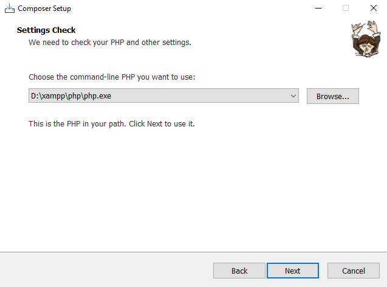

2. Download dan install Git (Git Bash)

3. Buat folder "tubes" yang kemudian dibuka melalui git

4. Install laravel, tunggu sampai selesai

   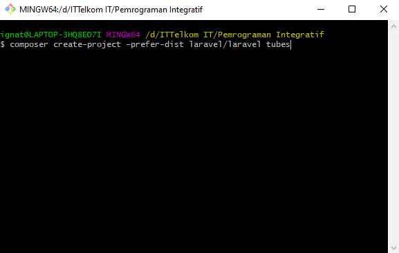

   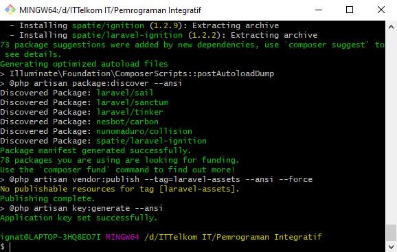

5. Buka folder 'Pemrograman Integratif', lalu install composer

   ```
   composer install
   ```

   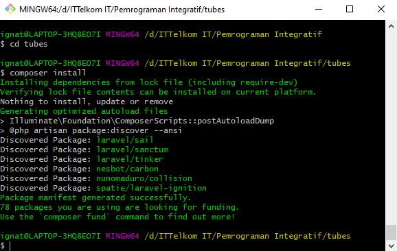

6. Kemudian ketik

   ```
   php artisan key:generate
   ```

   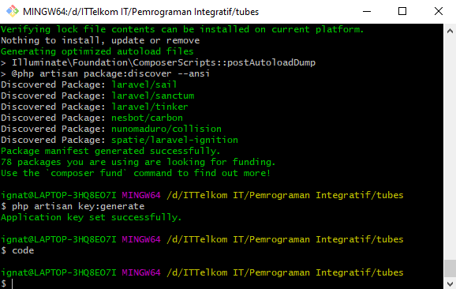

   Ketik code untuk mengecek apakah vs code dapat terbuka

7. Selanjutnya ketik

   ```
   php artisan serv
   ```

   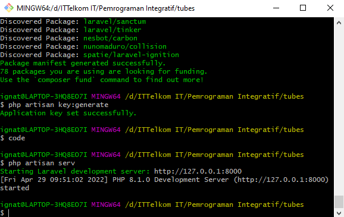

8. Copy link http yang pada dalam kurung kemudian paste ke browser, dan muncul laravel 8

   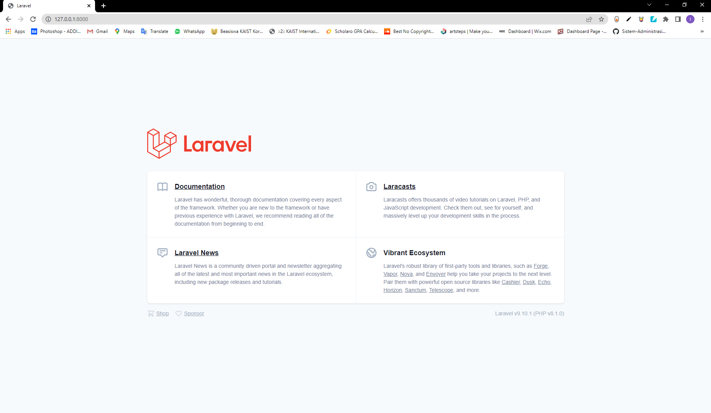

------

# Final Project Phase 2

**Ignatia Indreswari  1202190022 [ IT 02-01 ]**

------

## Step by Step

------

1. Mengubah DB_DATABASE di .env sesuai dengan yang ada di php my admin

   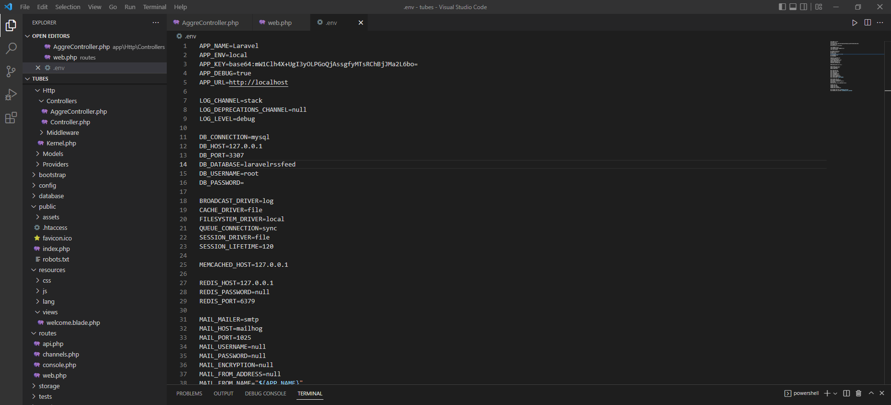

   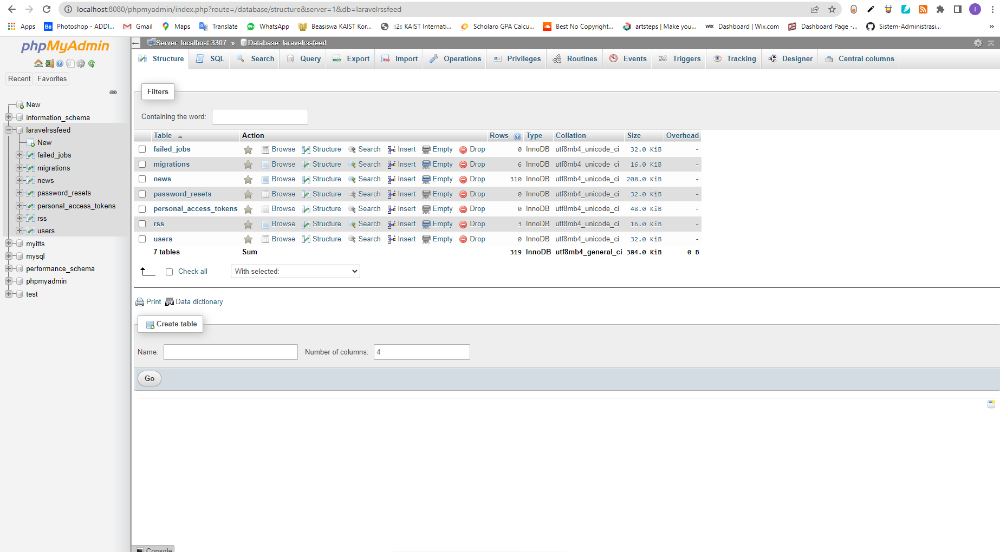

2. Membuat file AggreController.php di app/http/controllers

   ```php+html
   php artisan make:controller AggreController
   ```

3. Edit file AggreController.php

   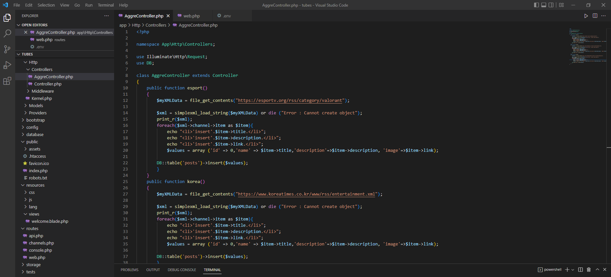

4. Menambahkan Route di we.php

   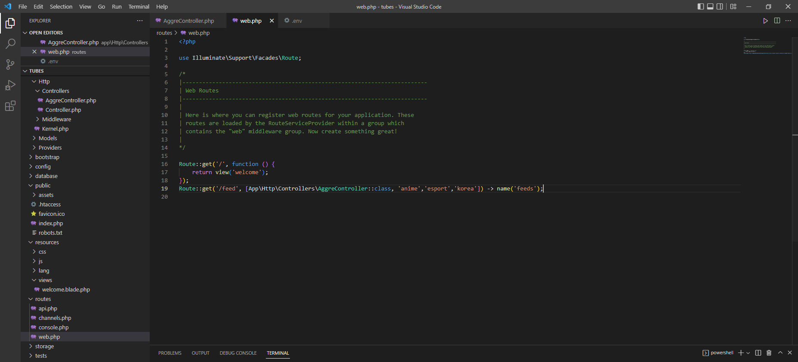

5. Cek di DB apakah sudah terupdate

   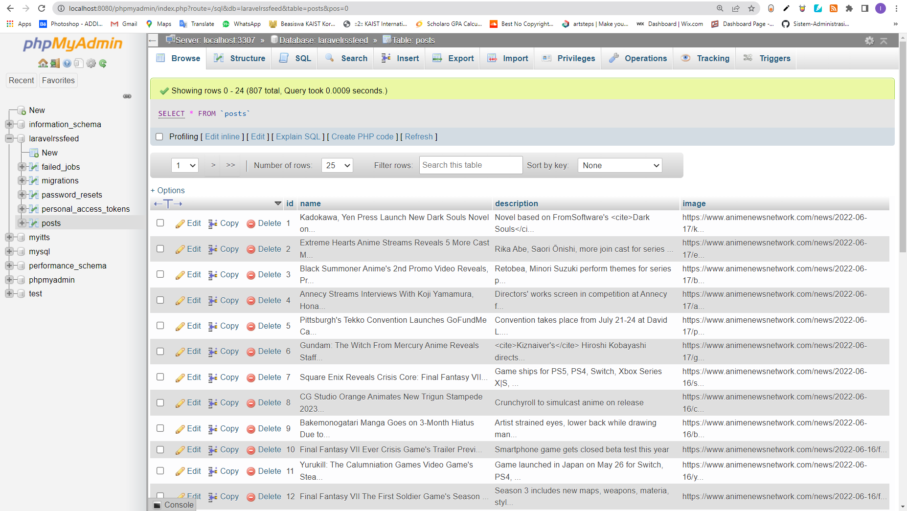

   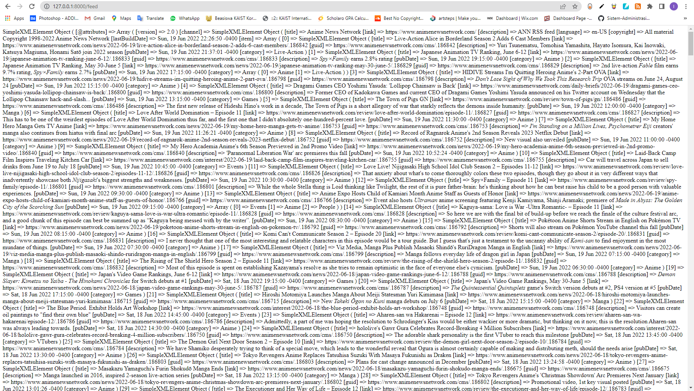

   ------

   ​