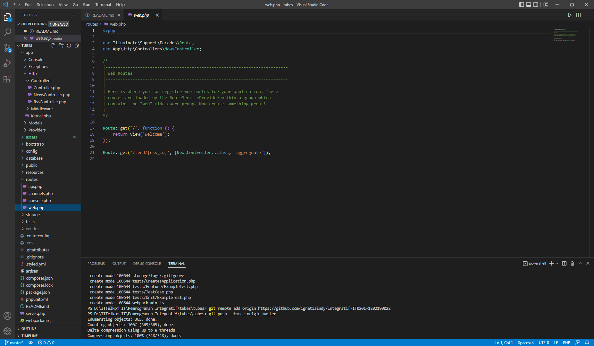

# Final Project Phase 1

**Ignatia Indreswari  1202190022 [ IT 02-01 ]**

------

## Step by Step

------

1. Install composer (harus ada php terlebih dahulu biasanya sudah ada di xampp)

   

2. Download dan install Git (Git Bash)

3. Buat folder "tubes" yang kemudian dibuka melalui git

4. Install laravel, tunggu sampai selesai

   

   

5. Buka folder 'Pemrograman Integratif', lalu install composer

   ```
   composer install
   ```

   

6. Kemudian ketik

   ```
   php artisan key:generate
   ```

   

   Ketik code untuk mengecek apakah vs code dapat terbuka

7. Selanjutnya ketik

   ```
   php artisan serv
   ```

   

8. Copy link http yang pada dalam kurung kemudian paste ke browser, dan muncul laravel 8

   

------

# Final Project Phase 2

**Ignatia Indreswari  1202190022 [ IT 02-01 ]**

------

## Step by Step

------

1. Mengubah DB_DATABASE di .env sesuai dengan yang ada di php my admin

   

   

2. Membuat file RssController.php dan NewsController.php di app/http/controllers

   ```
   php artisan make:controller RssController
   php artisan make:controller NewsController
   ```

3. Menjalankan migration dan seeding

   ```
   php artisan migrate:fresh
   php artisan migrate --seed
   ```

4. Edit file NewsController.php

   

5. Menambahkan Route di web.php

   

6. Cek di DB apakah sudah terupdate

   

   

   

   

   

------

# Final Project Phase 3

**Ignatia Indreswari  1202190022 [ IT 02-01 ]**

------

## Step by Step

------

Menggunakan 3 RSS
Esport : https://esportv.org/rss/category/valorant

Korea : https://www.koreatimes.co.kr/www/rss/entertainment.xml

United Nation : https://news.un.org/feed/subscribe/en/news/region/middle-east/feed/rss.xml

1. Membuat file blade.php di recources/views

   ```
   header.blade.php
   footer.blade.php
   esport.blade.php
   korea.blade.php
   united.blade.php
   ```

   

   

   

2. Menambahkan Route di web.php

   

3. Menambahkan beberapa Controller

   ```
   FeedController.php
   EsController.php //untuk esport
   KoController.php //untuk korea
   UnController.php //untuk united nation
   ```

   
   
   
   

4. Tampilan dari InFeed

   
   
   
   
   

------
